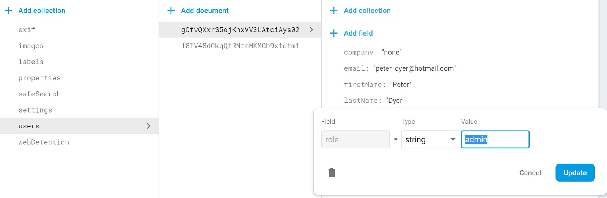

We have a page called Admin that is managed via local state. To make use of this page we need to start tracking a user's role somewhere so that we can use it to figure out what to show the user in the application.

<!--truncate-->

## Background

Authorization with a Firebase application involves two parts, much like Authentication. The first part is limiting the front-end of our application to only show the user what makes sense for their role. The second part is making the back-end enforces the rules around what a user's role is allowed to do. We will focus on part one (the front-end) in this post.

We are going to keep roles very simple in our application. We will have a 'user' and an 'admin'.

## Walk Through

We will update our authenticate and authCheck actions to handle the user role. When a new user registers to the application we add a field called role with the value 'user'. When an existing user logs in we retrieve role. Lastly, we add role to the user object that is added to the auth store.

```js title="actions/auth.js (existing)"
...
export const authenticate = (user, isLogin) => async (dispatch) => {
  dispatch(authStart());
  let authUser;
  let firstName;
  let role;
    try {
    if (isLogin) {
      authUser = await login(user.email, user.password);
      const fetchedUser = await fetchUser(authUser.uid);
      firstName = fetchedUser.firstName;
      role = fetchedUser.role;
    } else {
      authUser = await register(user.email, user.password);
      firstName = user.firstName;
      role = 'user';
      try {
        await createUser({
          uid: authUser.uid,
          email: user.email,
          firstName: user.firstName,
          lastName: user.lastName,
          company: user.company,
          agreeToTerms: user.agree,
          role
        });
      } catch (err) {
        await deleteUser();
        throw err;
      }
    }
    localStorage.setItem('ml-uid', authUser.uid);

        await handleToken();

        dispatch(
          authSuccess({
            uid: authUser.uid,
            email: user.email,
            firstName,
            role
          })
        );

  } catch (err) {
    dispatch(authFail(err.message));
  }
};
...
export const authCheck = () => async (dispatch) => {
  dispatch(authStart());
  try {
    // retrieve token from Local Storage
    const token = localStorage.getItem('ml-token');
    if (!token) {
      // if there is no token, log as a failed auth and logout to cleanup auth store
      dispatch(authFail(errors.NO_TOKEN));
      dispatch(logout());
    } else {
      const expiry = localStorage.getItem('ml-expiry');
      const now = Date.now();
      if (now > expiry) {
        // if there is a token but the current time is greater than the expriry,
        // log as a failed auth and logout to cleanup auth store
        dispatch(authFail(errors.TOKEN_EXPIRED));
        dispatch(logout());
        } else {
        // retrieve user from db based on what is in local storage
        const uid = localStorage.getItem('ml-uid');
        const dbUser = await fetchUser(uid);
        const curToken = await getToken(false);
        if (token !== curToken) {
          // if token in local storage does not match what Firebase Authentication has,
          // log as a failed auth and logout to cleanup auth store
          dispatch(authFail(errors.TOKEN_NOTVALID));
          dispatch(logout());
        } else {
          // if there is a token and it is not expired,
          // write user info to the store, handle token expiry
          dispatch(
          authSuccess({
            uid,
            role: dbUser.role,
            firstName: dbUser.firstName,
            email: dbUser.email
            })
          );
          handleToken();
        }
      }
    }
  } catch (err) {
  dispatch(authFail(err.message));
  dispatch(logout());
  }
};
...
```

Now we have something called role on the user object in the auth store that we can use in our app. We can remove the local state on the App component where we were simulating an admin user. We can (must) also remove the prop we are been passing down to RepsonsiveMenuContainer.jsx. We already have access to the user object in that component and in the DesktopMenu and MobileMenu components where we are passing down the user object. We will update all of these components accordingly.

```jsx title="App.jsx (updated)"
...
availableRoutes = (
  <ResponsiveMenuContainer>
  <Switch>
  {user.role === 'admin' && (
    <Route path={routes.ADMIN} component={Admin} />
  )}
...
```

```jsx title="ResponiveMenu.jsx (updated)"
...
export default function ResponsiveMenu({ children, user, boundLogout }) {
return (
<>
  <DesktopMenu user={user} logout={boundLogout}>
    {children}
  </DesktopMenu>
  <MobileMenu user={user} logout={boundLogout}>
    {children}
  </MobileMenu>
</>
);
}

ResponsiveMenu.propTypes = {
children: PropTypes.element.isRequired,
user: PropTypes.object.isRequired,
boundLogout: PropTypes.func.isRequired
};
...
```

```jsx title="DesktopMenu.jsx (updated)"
...
{user.role === 'admin' && (
  <Menu.Item name="admin" as={NavLink} to={routes.ADMIN}>
    Admin
  </Menu.Item>
)}
...
```

```jsx title="MobileMenu.jsx (updated)"
...
{user.role === 'admin' && (
  <Menu.Item
    name="admin"
    as={NavLink}
    to={routes.ADMIN}
    onClick={() => setSidebarOpened(false)} >
    Admin
  </Menu.Item>
)}
...
```

You should now be able to create a new user and when you login you should not see the Admin page (menu or route). In order to see the Admin page we can edit the user object directly in Firestore. Pick a user from your users collection and change the user's role from 'user' to 'admin'. For the time being we will leverage Firestore as our 'role' editor. We may address this down the road.



That's it for this post. We have some simple delineation between two roles that we can expand as needed in the future.

## Next

With this post we addressed authorization on the front-end. In the next post we will discuss authorization with our Firebase back-end.

## Code

<https://github.com/peterdyer7/media-library/tree/21.Authorization>
