In this post we will create a very simple (and not practical) Todo API using AWS AppSync with an AWS Lambda Data Source. This example is meant to outline the steps involved in the process and in no way creates a useful API.

<!--truncate-->

### Step 1 - Create Lambda Function

In the AWS Console I am navigating to the Lambda service.

- Select the Functions page
- Click on Create function

  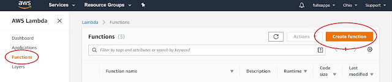

- Select Author from scratch and complete the form

  - Name = TodosAPIFuction (or another name if you prefer)
  - Runtime = Node.js 8.10
  - Role = Choose an existing role
    - If you don't have a role you want to use, select Create a custom role and Allow on the subsequent screen to create the lambda_basic_execution role
  - Existing role = lambda_basic_execution

    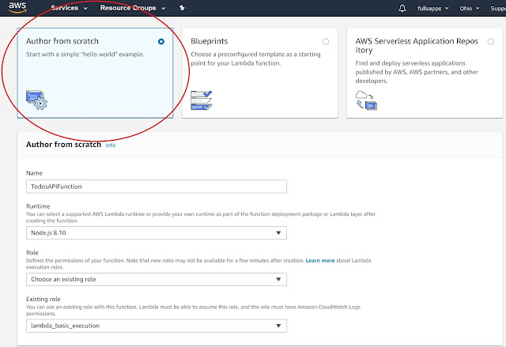

- Click on Create function
- On the subsequent screen scroll down to the Function code section
- Replace the code in index.js with the following (note that we are just mocking the adding of a todo, todos are not actually added to the list)

```js
exports.handler = (event, context, callback) => {
  console.log('Received event {}', JSON.stringify(event, 3));
  var todos = [
    { id: '1', name: 'First todo - lambda', description: 'something about the todo' },
    { id: '2', name: 'Second todo - lambda', description: 'something about another todo' },
  ];

  console.log('Got an Invoke Request.');
  switch (event.resolver) {
    case 'getTodo':
      var id = event.arguments.id;
      callback(
        null,
        todos.find((todo) => todo.id === id)
      );
      break;
    case 'listTodos':
      callback(null, todos);
      break;
    case 'addTodo':
      // return the arguments back
      callback(null, event.arguments);
      break;
    default:
      callback('Unknown resolver, unable to resolve' + event.resolver, null);
      break;
  }
};
```

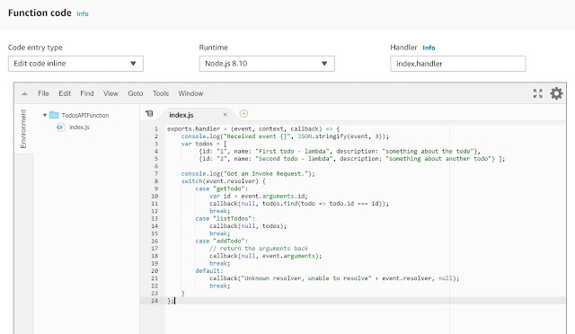

- Click on Save
- I will write some tests to be sure the function is doing what we expect, from the "Select a test event.." drop-down select Configure test events
- On the Configure test events page
  - Leave the defaults (Create new test event & Event template=Hello World)
  - Event name = addTodo
  - In the code area paste the following:

```json
{
  "resolver": "addTodo",
  "arguments": {
    "id": "3",
    "name": "a new todo",
    "description": "describing the new todo"
  }
}
```

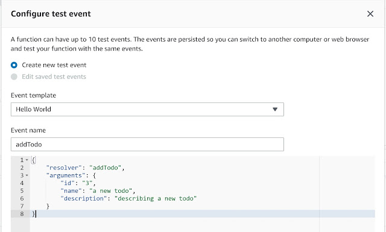

- Click on Create
- Back on the TodosAPIFunction page, verify that addTodo is selected and click on Test
- The test should be successful (do not proceed until it is)

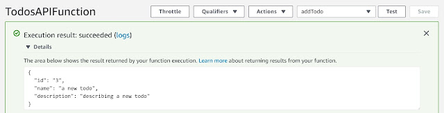

- I will follow the same pattern to create a test for getTodo

```json
{
  "resolver": "getTodo",
  "arguments": {
    "id": "1"
  }
}
```

- I will follow the same pattern to create a test for listTodos

```json
{
  "resolver": "listTodos"
}
```

### Step 2 - Create a new AppSync API

In the AWS Console I am now navigating to the AWS AppSync service.

- Click on Create API

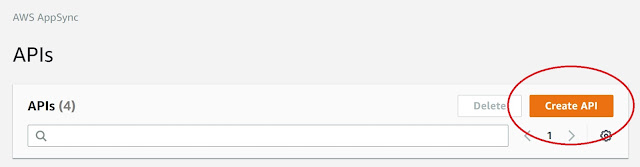

- On the Getting Started page select Build from scratch and click on Start

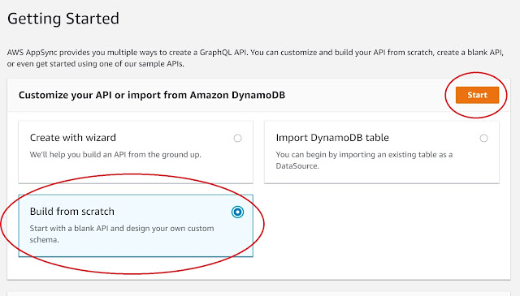

- API name = LambdaTodosAPI (or another name if you prefer)

### Step 3 - Add Lambda function as a Data Source to API

- Select the Data Sources page from the menu on the left

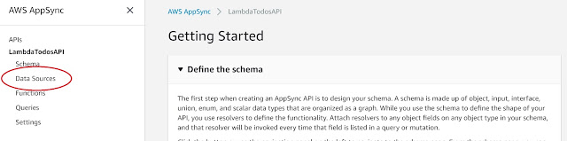

- On the Data Sources page click on Create data source
- On the Create new Data Source form fill in the following

  - Data source name = LambaTodosAPIFunction (or another name if you prefer)
  - Data source type = AWS Lambda function
  - Region = choose the region where you created the Lambda Function (for me that's the same region I'm creating the API in, it probably should be for most people)
  - Function ARN = identify the Lambda function you created previously and select it (if you followed my naming suggestions you should see an ARN that ends with function:TodosAPIFunction)
  - Create or use an existing role = New role
  - Click on Create

  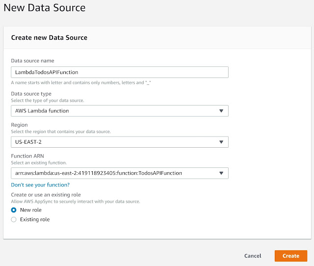

### Step 4 - Create API Schema (GraphQL schema)

- Select the Schema page from the menu on the left
- Clear the Schema and paste the following

```graphql
type Mutation {
  addTodo(id: ID!, name: String!, description: String): Todo!
}

type Query {
  getTodo(id: ID!): Todo
  listTodos: [Todo]
}

type Todo {
  id: ID!
  name: String!
  description: String
}

schema {
  query: Query
  mutation: Mutation
}
```

- Click on Save Schema

  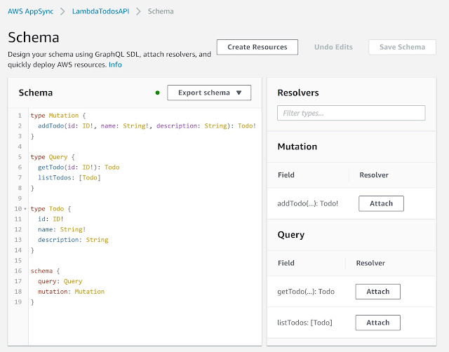

### Step 5 - Attach Resolvers and Edit Mappings

- Next to the addTodo Mutation in the Resolver panel click on Attach

  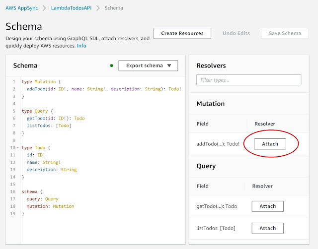

- Select the Data source name entered earlier (LambdaTodosAPIFunction)
- Edit the Configure the request mapping template to look like this and click on Save Resolver

```json
{
  "version" : "2017-02-28",
  "operation": "Invoke",
  "payload": {
    "resolver": "addTodo",
    "arguments": $util.toJson($context.arguments)
  }
}
```

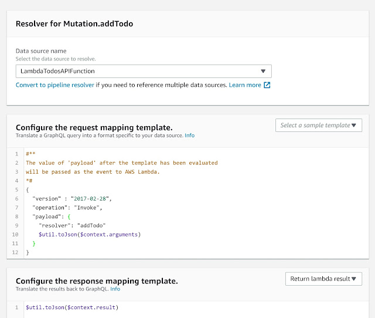

- Follow the same pattern for getTodo adjusting the request mapping as follows

```json
{
  "version" : "2017-02-28",
  "operation": "Invoke",
  "payload": {
    "resolver": "getTodo",
    "arguments": $util.toJson($context.arguments)
  }
}
```

- Follow the same pattern for allTodos adjusting the request mapping as follows

```json
{
  "version": "2017-02-28",
  "operation": "Invoke",
  "payload": {
    "resolver": "listTodos"
  }
}
```

### Step 6 - Test API

- Select the Queries page from the menu on the left
- Delete the contents of the query
- To get a list of all Todos enter the following

```graphql
query {
  listTodos {
    id
    name
    description
  }
}
```

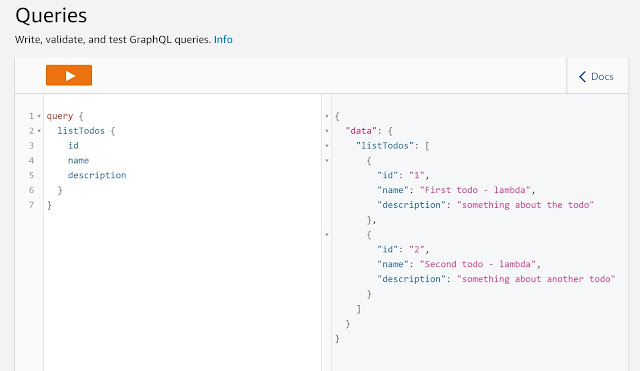

- To retrieve a single Todo enter the following

```graphql
query {
  getTodo(id: "2") {
    id
    name
    description
  }
}
```

- To add a Todo enter the following (note that we are not really adding a todo, subsequent queries will not return the added todo)

```graphql
mutation {
  addTodo(id: "3", name: "3rd todo") {
    id
    name
    description
  }
}
```

### Step 7 - Use the API

I am going to forego this step for the sake of wrapping up this, way too long, post. At this point the API is publicly accessible and can be used by an external application. Note that the key pieces of information needed to use your API (API URL, which is the GraphQL endpoint, and API Key) are available on the Settings page.

Also, if you bring up the main page for your AWS AppSync API you will see some suggestions from AWS as to how you can now integrate your API with an iOS, Android or JavaScript application leveraging AWS Amplify. I have posted a separate blog on using AWS Amplify to create a React web application that builds an AWS AppSync back-end (that's a different process than we followed in this post).
