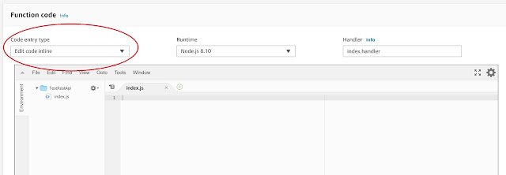

In this day and age, the era of serverless applications and microservices, it is not unusual that one back-end needs to call another back-end to complete a task. Recently, I found myself needing to make an API call from the server-side (back-end) of a serverless application written with the AWS serverless stack. I'm intentionally using a small s with AWS serverless as I am not referring to the AWS Serverless reference architecture but to an application that leverages an AWS back-end without using servers. In particular, I am leveraging AWS Amplify and AppSync (if you have found this post you have likely seen my posts regarding those technologies) which are, as of the time of this post, not part of the AWS Serverless reference architecture.

<!--truncate-->

## Scenario

I want to create a Lambda function that can call an external REST API. This probably sounds trivial and it actually is. There are something like 43,257 ways to call a REST API with Javascript alone (that's not a real number). The reason I wanted to post something on this topic is that I don't like the examples that are out "there" for doing this. I also don't think the AWS Lambda documentation does a good job of highlighting the "best" (my definition) way to do this.

## Where I Started

I started off thinking I would take advantage of being able to write code directly in the Lambda console. That's a pretty nice feature. I like Javascript and Node so I chose the Node.js 8.10 Runtime. The one challenge is that you are limited to the libraries that are part of Node (more on this in a minute). I ended up finding a Blueprint that captures what I am trying to do. It leverages the https library that is a part of Node.


Although I was pleased to find an example of what I was trying to do I really didn't like the code. First, the code uses the Lambda callback pattern instead of async/await. Second, the actual request doesn't use promises at all so rewriting it to use async/await is a non-starter (someone smarter than me would likely have a different take on that).


All in all, the code is old and follows outdated patterns. Although I am just authoring one function and I can (and did) make this code work, it is not very readable and it would present a maintenance challenge to anyone needed to edit it in the future. The idea of re-learning an old pattern to support code when it breaks is not a happy thought. So, I decided it was worth learning more about how to add a more modern REST client to the mix. I'm not looking for anything fancy, node-fetch will work just fine.

## Where I Ended Up

It seems a bit silly now but I was hesitant to us the ability to upload a zip file with the libraries I wanted. I was worried that I would end up writing code locally that I wouldn't be able to execute locally, and also wouldn't be able to edit after uploading to Lambda. That was DUMB!

It turns out the ability to upload from a zip file works great and the code is easily maintained in Lambda. Maybe I was reading the wrong documentation, maybe this is buried somewhere in the Lambda documentation but this process is dead simple and had I known how it worked it would have saved me a lot of time.

Here's my new process for creating exactly the Lambda function I want (that is easily maintained because it follows modern, current practices, and uses libraries I like).

1. Create function (in the AWS Lambda console)

- Author from scratch
- Name - whatever you like (I am entering TestRestApi)
- Runtime - Node.js 8.10
- Role - there are probably entire blog series dedicated to this topic, if you are doing this for the first time select:
  - Create a new role from one or more templates
  - Role name - whatever you like (I am entering lambda_basic)
  - Policy templates - leave this blank (it doesn't seem like this should work but it will)
- Click Create function
- If everything goes well you will end up on the page for the function, we will come back to this in a moment


2. Create a node project locally (you do need to have a node development environment setup with node and npm - if you are reading this you likely do)

- Create a new folder, call it whatever you like
- In that folder create a bare bones node project
  - From the command line run: npm init -y
    - This creates a package.json file
  - Create a local file called index.js
- Return to the lambda function we created in the first step and cut the code from the index.js file that is displayed on the page
- Paste the cut code into your local index.js and save
- Install node-fetch (you could pick a different REST client if you prefer, I will show other examples following this pattern with alternate clients in another post)
  - From the command line run: npm install --save node-fetch
    - This creates a node_modules folder (it turns out this is what we were after all along)

3. Create a zip file

- In the local project directory create a zip file, call it whatever you like
- Add index.js and the node_modules folder (and all of its contents as they sit) to the zip file

4. Upload the zip file

- Return to the Lambda console
- Directly above the code window where we cut the contents of index.js there is a dropdown labeled "Code entry type"



- Select "Upload a .zip file"
  - Click the Upload button and select the zip file you created
- Save the function
  - You should now see the contents of the index.js file updated
  - You should also see the node_modules folder in the tree


5. Edit the code in the Lambda console and execute

- I have deleted the boilerplate function and replaced it with:

```js
const fetch = require('node-fetch');

exports.handler = async (event) => {
  const res = await fetch('https://swapi.co/api/people/1');
  const json = await res.json();
  return json;
};
```

- Save the function
- Create a Test
  - Follow the Hello World template but cut out the content the test
  - Save


- Back on the function page
  - Select the Test (from the dropdown)
  - Click the Test button
  - View the result details
    - You should see a JSON document with a bunch of details about our good friend Luke Skywalker


## Conclusion

It took me too long to find this pattern but now that I know it I plan on using it a lot. I am also going to experiment with Layers. It seems that if you have libraries that you require in multiple functions you can add them as Layers and not have to upload to each individual function (be on the lookout for a future post on this).
