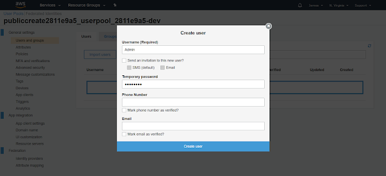

Since the release of [multiple authorization support in Amplify GraphQL](https://aws.amazon.com/blogs/mobile/using-multiple-authorization-types-with-aws-appsync-graphql-apis/), a number of excellent blogs [[1]](https://medium.com/@fullstackpho/aws-amplify-multi-auth-graphql-public-read-and-authenticated-create-update-delete-1bf5443b0ad1)[[2]](https://dev.to/robertbroersma/querying-owned-posts-vs-all-posts-in-aws-amplify-35jl) have been written about how multi-auth can readily support the public read, authenticated CRUD use case.

This post describes using multi-auth to support another use case: public create, authenticated read/update/delete:

- Public ("unauthenticated") users can create objects in a GraphQL table; i.e., a user can create an object in the table without having to sign in with user name and password.
- The unauthenticated user cannot read, update, or delete any object in the table.
- An authenticated user can read, update, delete the objects that s/he owns in the same GraphQL table after signing into Amazon Cognito with user name and password.

<!--truncate-->

An example of this use case is where a website has a public form that asks users to fill out (e.g., taking a survey) without having to sign in. The information from the form is stored in the GraphQL table. Other than creating the form data in the table, unauthenticated users cannot read, update, or delete the data in the table. On the other hand, the owner of the form is the authenticated user who can collect and process the information stored in the table after signing in with user name and password.

To show this use case, we will walk through building an example React app which we will call "publiccreate".

The app will have a simple form allowing anyone to enter a name to sign up, after which the names are stored in a GraphQL table:


To show that the pubic user cannot read the names in the table, the user will get an error when the "List Signups" button is selected.

When the "Log in as Admin" button is selected, the Amplify authentication log in screen is presented to the user:


After logging in as Admin, the Admin can see the names that have been entered, and can also delete any names from the table:


To support this use case, the following authorization types are used in this example app:

- AWS IAM type for the unauthenticated public user
- Amazon Cognito User Pool for the authenticated user called "Admin"

We will walk through the following steps to create this example app:

- Create React App
- Initialize Amplify project
- Configuring multi-auth in GraphQL
- Enabling unauthenticated access
- Defining the schema with multi-auth rules and ownership
- Deploying the backend to the cloud
- Creating "Admin" user in Cognito User Pool
- Developing & testing the app

## Getting Started

Setting up React, Amplify: https://aws-amplify.github.io/

## Create React App

First, we create the React app:

```bash
npx create-react-app publiccreate
```

## Amplify Init

We now initialize the Amplify project:

```
cd publiccreate
amplify init
Note: It is recommended to run this command from the root of your app directory
? Enter a name for the project publiccreate
? Enter a name for the environment dev
? Choose your default editor: Visual Studio Code
? Choose the type of app that you're building javascript
Please tell us about your project
? What javascript framework are you using react
? Source Directory Path:  src
? Distribution Directory Path: build
? Build Command:  npm.cmd run-script build
? Start Command: npm.cmd run-script start
Using default provider  awscloudformation

For more information on AWS Profiles, see:
https://docs.aws.amazon.com/cli/latest/userguide/cli-multiple-profiles.html

? Do you want to use an AWS profile? Yes
? Please choose the profile you want to use default
Adding backend environment dev to AWS Amplify Console app: d1rzx3mroddkau
| Initializing project in the cloud...
```

## Configuring Multi-Auth in GraphQL API

The next step is to add the GraphQL API with multi-auth support by running _amplify add api_.

As **highlighted** below:

- The Amazon Cognito User Pool will be the default authorization type and will be used for the "Admin" user.
- You have to choose "configure advanced settings for the GraphQL API" in order to configure the additonal AWS IAM auth type which will be used for public users.

<code>

amplify add api
? Please select from one of the below mentioned services: GraphQL
? Provide API name: publiccreate
? Choose the default authorization type for the API **Amazon Cognito User**
**Pool**
Using service: Cognito, provided by: awscloudformation

The current configured provider is Amazon Cognito.

Do you want to use the default authentication and security configuration?
Default configuration
Warning: you will not be able to edit these selections.

How do you want users to be able to sign in? Username
Do you want to configure advanced settings? No, I am done.
Successfully added auth resource
? Do you want to configure advanced settings for the GraphQL API **Yes, I**
**want to make some additional changes.**
? Configure additional auth types? **Yes**
? Choose the additional authorization types you want to configure for the API **IAM**
? Configure conflict detection? No
? Do you have an annotated GraphQL schema? No
? Do you want a guided schema creation? Yes
? What best describes your project: Single object with fields (e.g., “Todo”
with ID, name, description)
? Do you want to edit the schema now? Yes

</code>

At this point, you are ready to define the schema to support this use case.

## Defining The Schema

The file that you are editing is (relative to the project's root directory) amplify/backend/api/publiccreate/schema.graphql. Replace the contents with the following:

```graphql
type Signup @model @auth(rules: [{ allow: owner }, { allow: public, provider: iam, operations: [create] }]) {
  id: ID!
  name: String
  owner: String
}
```

"Signup" is a simple table where "name" will store the name that the public user will enter on the form.
The critical configurations are the auth rules and the "owner" field:

- **allow: owner** specifies that the owner of the table can perform the default operations, namely create, read, update, delete. By default, the authorization provider is AWS Cognito User Pools. In our example, the owner will be the Cognito user "Admin" which we will create in the following steps below.
- **allow: public, provider: iam, operations: [create]** specifies that a public user can use the AWS IAM authorization provider to create objects in the table but is not allowed to perform any other operation on the objects.
- **owner: String** specifies the Cognito user name who will own the object in the table which in our case will be the "Admin" user name. As you will see later in the code, after the unauthenticated user enters a name, the code will add an object into the Signup table consisting of the name that the user provided, and owner set to be "Admin". This makes "Admin" the owner for the object that the unauthenticated user is creating. Because the object's ownership is "Admin", unauthenticated users no longer have the authority to read, update, or delete the object (even though the unauthenticated user created the object). Please refer here for the full background on ownership authorizations.

## Enabling Unauthenticated Access

To enable unauthenticated access, we have to update the Amplify auth category by running _amplify auth update_, and walk through all the auth configuration as **highlighted** below:

<code>

amplify auth update
Please note that certain attributes may not be overwritten if you choose to
use defaults settings.

You have configured resources that might depend on this Cognito resource.
Updating this Cognito resource could have unintended side effects.
Using service: Cognito, provided by: awscloudformation
What do you want to do? **Walkthrough all the auth configurations**
Select the authentication/authorization services that you want to use:
**User Sign-Up, Sign-In, connected with AWS IAM controls (Enables per-user**
**Storage features for images or other content, Analytics, and more)**

Allow unauthenticated logins? (Provides scoped down permissions that you can
control via AWS IAM) **Yes**
Do you want to enable 3rd party authentication providers in your identity pool?
No
Do you want to add User Pool Groups? No
Do you want to add an admin queries API? No
Multifactor authentication (MFA) user login options: OFF
Email based user registration/forgot password: Enabled (Requires per-user email
entry at registration)
Please specify an email verification subject: Your verification code
Please specify an email verification message: Your verification code is ####

Do you want to override the default password policy for this User Pool? No
Specify the app's refresh token expiration period (in days): 30
Do you want to specify the user attributes this app can read and write? No
Do you want to enable any of the following capabilities?
Do you want to use an OAuth flow? No
? Do you want to configure Lambda Triggers for Cognito? No
Successfully updated resource publiccreate2811e9a5 locally

Some next steps:
"amplify push" will build all your local backend resources and provision it in
the cloud
"amplify publish" will build all your local backend and frontend resources (if
you have hosting category added) and provision it in the cloud
</code>

## Deploying The Backend

At this point, we have the Amplify api and auth categories configured locally which you can verify by running _amplify status_.

<code>

amplify status

Current Environment: dev

| Category | Resource name        | Operation | Provider plugin   |
| -------- | -------------------- | --------- | ----------------- |
| Auth     | publiccreate2811e9a5 | Create    | awscloudformation |
| Api      | publiccreate         | Create    | awscloudformation |

</code>

We are now ready to _amplify push_ the backend to the cloud.

<code>
PS C:\Users\pangj\publiccreate> amplify push
√ Successfully pulled backend environment dev from the cloud.

Current Environment: dev

| Category | Resource name        | Operation | Provider plugin   |
| -------- | -------------------- | --------- | ----------------- |
| Auth     | publiccreate2811e9a5 | Create    | awscloudformation |
| Api      | publiccreate         | Create    | awscloudformation |

? Are you sure you want to continue? Yes

GraphQL schema compiled successfully.

Edit your schema at ...\schema.graphql or place .graphql files in a directory
at \publiccreate\schema
? Do you want to generate code for your newly created GraphQL API Yes

? Choose the code generation language target javascript
? Enter the file name pattern of graphql queries, mutations and subscriptions
src\graphql\*\*\*.js
? Do you want to generate/update all possible GraphQL operations - queries,
mutations and subscriptions Yes
? Enter maximum statement depth [increase from default if your schema is deeply
nested] 2

Updating resources in the cloud. This may take a few minutes...

</code>

## Creating "Admin" User

Before we go to our React app, we need to create the Admin user in Cognito. Log into the AWS console, go to Cognito, and choose "Manage User Pools" as shown here:


After selecting the publiccreate user pool in the next screen, you will land on the following page where you should choose "Users and groups" and "Create User".


After selecting "Create User", enter "Admin" and any temporary password that you like as shown in the following popup, and hit "Create user":



At this point, the Admin user has been created. After we create the app below, the Admin user will be asked to change the password after signing in for the first time.

## The Example Signup App

We will develop the app in two parts:

- A simple form for a public user to enter names and stored in the Signup table that we've created in the backend. We will verify that the names are stored in the Signup table by going to the DynamoDB console. We will also create code to read the names in the Signup table and verify that public users cannot read from the Signup table.
- We will add a login page for the Admin user to sign in, and verify that Admin can read and delete objects in the Signup table. We will verify that after logging out, the Signup table objects cannot be read anymore.

First, run npm install aws-amplify @aws-amplify/ui-react from the project's root directory to install the Amplify components to be used by the app.

```
npm install aws-amplify @aws-amplify/ui-react
```

### Public Create

Edit src/App.js (relative to the project's root directory), and replace the contents with the following.

```jsx
import React, { useState } from 'react';
import Amplify, { API, graphqlOperation, Auth } from 'aws-amplify';
import { withAuthenticator } from '@aws-amplify/ui-react'; // To be used for Admin login
import '@aws-amplify/ui/dist/style.css'; // Needed to provide styling for Admin login
import { createSignup, deleteSignup } from './graphql/mutations';
import { listSignups } from './graphql/queries';
import awsconfig from './aws-exports';

Amplify.configure(awsconfig);

async function addSignup(event) {
  event.preventDefault();

  const data = new FormData(event.target);
  const name = data.get('name');

  if (name === '') {
    return;
  }

  try {
    await API.graphql({
      // Cannot use graphqlOperation() here
      query: createSignup,
      operationName: 'createSignup',
      variables: {
        input: {
          name: name,
          owner: 'Admin', // Owner is set to Admin
        },
      },
      authMode: 'AWS_IAM', // Create as unauthenticated IAM user
    });
  } catch (err) {
    alert('Failed to create signup ' + err);
  }

  alert('Added ' + name);
  document.getElementById('getname').value = '';
}

function ShowSignups() {
  const [signupList, setSignupList] = useState([]);

  const getSignups = async () => {
    let list;
    try {
      list = await API.graphql(graphqlOperation(listSignups));
    } catch (err) {
      alert('List Signups Error: ' + err);
      setSignupList([]);
      return;
    }

    setSignupList(list.data.listSignups.items);
  };

  return (
    <>
      <button onClick={getSignups}>List Signups</button>
      <table>
        {signupList.map((user) => (
          <tr>
            <td>{user.name}</td>
          </tr>
        ))}
      </table>
    </>
  );
}

function App() {
  return (
    <>
      <form onSubmit={addSignup}>
        <input id='getname' type='text' name='name' placeholder='Enter name' />
        <input type='submit' value='Sign up' />
      </form>
      <ShowSignups />
    </>
  );
}

export default App;
```

App() creates a simple form allowing anyone to enter a name. When a name is submitted, addSignup() is called to create a Signup object using GraphQL:

```jsx
await API.graphql({
  // Cannot use graphqlOperation() here
  query: createSignup,
  operationName: 'createSignup',
  variables: {
    input: {
      name: name,
      owner: 'Admin', // Owner is set to Admin
    },
  },
  authMode: 'AWS_IAM', // Create as unauthenticated IAM user
});
```

Note the following:

- AWS_IAM is set as the auth type
- graphqlOperation() cannot be used to pass the operation to API.graphql() because it doesn't expose the authMode parameter
- 'Admin' is set in the owner field

ShowSignups() calls API.graphql() to get the names from the Signup table. API.graphql() will return an error if it is unable get the names from the Signup table.

Now save App.js and run npm start from the project's root directory.

Enter a name and hit "Sign up".


Then click "List Signups" and you will get the following error message (from the graphQL call) as expected since you are a public user:


To verify that the names have been created in the Signup table, log into the AWS console, and go to DynamoDB to search for the Signup table and see the contents of the table:


Note that the names have been added, and owner for each item is Admin.

### Admin Read, Delete

The remaining work is to add code to support logging in as an Admin, and be able to read and delete the names that have been entered by public users.

Update App() to the following:

```jsx
function App() {
  const [loginAsAdmin, setLoginAsAdmin] = useState(false);

  const handleLogout = async () => {
    try {
      await Auth.signOut();
    } catch (err) {
      alert('Unable to log out: ' + err);
    }

    setLoginAsAdmin(false);
  };

  const LoginAdmin = () => {
    return (
      <>
        <ShowSignups />
        <button onClick={handleLogout}>Logout</button>
      </>
    );
  };

  if (loginAsAdmin) {
    const AdminScreen = withAuthenticator(LoginAdmin); // Amplify auth login screen
    return <AdminScreen />;
  }

  return (
    <>
      <form onSubmit={addSignup}>
        <input id='getname' type='text' name='name' placeholder='Enter name' />
        <input type='submit' value='Sign up' />
      </form>
      <ShowSignups />
      <button onClick={() => setLoginAsAdmin(true)}>Log in as Admin</button>
    </>
  );
}
```

We are leveraging the Amplify Higher Order Component withAuthenticator() to show the Amplify login screen.

The ShowSignups component is reused by the new code in LoginAdmin() to get the names in the Signup table. Update ShowSignups to the following code to allow the Admin to delete objects from the Signup table.

```jsx
function ShowSignups() {
  const [signupList, setSignupList] = useState([]);

  const getSignups = async () => {
    let list;
    try {
      list = await API.graphql(graphqlOperation(listSignups));
    } catch (err) {
      alert('List Signups Error: ' + err);
      setSignupList([]);
      return;
    }

    setSignupList(list.data.listSignups.items);
  };

  const removeSignup = async (id) => {
    try {
      await API.graphql(graphqlOperation(deleteSignup, { input: { id: id } }));
    } catch (err) {
      alert('Failed to delete ' + err);
    }

    getSignups();
  };

  return (
    <>
      <button onClick={getSignups}>List Signups</button>
      <table>
        {signupList.map((user) => (
          <tr>
            <td>{user.name}</td>
            <td>
              <button onClick={() => removeSignup(user.id)}>Delete</button>
            </td>
          </tr>
        ))}
      </table>
    </>
  );
}
```

Now run the app. Click the "Log in as Admin" button", and it will take you to the Amplify auth login screen. Log in as Admin with the password that you had set when you created the Admin user above.


The first time you log in as "Admin", you will be asked to change the password. You will also be asked to verify contact information in which case you can just specify "skip" for now.

Now when you click "List Signups", you should see the names that have been entered.


Furthermore, you can delete any name, and the list will refresh. You can also go back to DynamoDB in the AWS Console as above to verify the contents of the table.

Click "Logout", and you will be taken back to the public user page where you will get an error again if you click "List Signups".

## Summary

We have walked through creating a React app using Amplify multi-auth to support the public create, authenticated read/update/delete use case. The key considerations to supporting this use case are:

- Choose "configure advanced settings for the GraphQL API" when you run amplify add api in order to specify the additional AWS IAM auth type
- Choose "Walkthrough all the auth configurations" when you run amplify update auth in order to allow unauthenticated logins
- Defining the schema with the auth rules { allow: owner }{ allow: public, provider: iam, operations: [create] } and explicit definition of the "owner" field
- Calling API.graphql() without graphQLOperation() to create an object so that authMode can be set to "AWS_IAM", and to assign the owner field to an authenticated user
